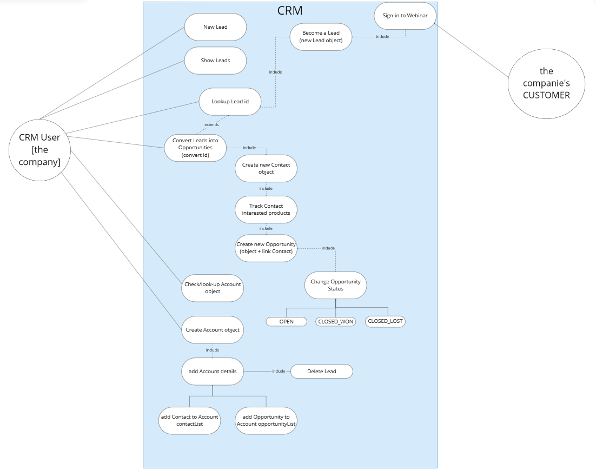

# MasterCRM
#### Created by: Drina Luburich & Iván Amoros & Daniel López
 

### Installation
This application is optimized to be used in the terminal, to execute the program, you must "--- PDTE AÑADIR COMANDOS--"

### General Usage 
In order to access the application, at first the user will be required to log in to it.

The application works through commands, so you will have to take into account the following available options:

IMPORTANT: The commands are Case-Sensitive!

> Leads
- To create a new lead, type: “New Lead”. You will be prompted to input the information necessary to create the lead instance.
- To lookup a lead, type: “Lookup Lead ###”, where “###” corresponds to the unique numeric identifier of the lead to show.
- To show all leads, type “Show Leads”.
- To lookup leads by name, type: “Search Leads ###”, where “###” corresponds to the first or last name you want to search. The result will be a list of Leads with names containing the name introduced.

> Opportunities
- To convert a lead into an opportunity, type: “Convert ###” where “###” corresponds to the unique numeric identifier of the lead to convert. You will be prompted to input the info necessary to create an opportunity instance and an account instance.
- To show all opportunities, type: “Show opportunities”.
- To lookup an opportunity, type: “Lookup-opp ###” where “###” corresponds to the unique numeric identifier of the opportunity.
- Tho change the status of an opportunity, type: “Close-won ###” or “Close-lost ###” where “###” corresponds to the unique numeric identifier of the opportunity to modify.
 
> Accounts
- To show all accounts, type: “Show accounts”.

> Contacts
- To show all contacts, type: “Show Contacts”.

> Reports
- To show the available reports, type: “Show reports”. Inside of this category, you will be able to check the following reports:
  - Reports by SalesRep
    - To see a count of Leads by SalesRep, type: “Report Lead by SalesRep”.
    - To see a count of Opportunities by SalesRep, type: “Report Opportunity by SalesRep”.
    - To see a count of CLOSED-WON Opportunities by SalesRep, type: “Report CLOSED-WON by SalesRep”.
    - To see a count of CLOSED-LOST Opportunities by SalesRep, type: “Report CLOSED-LOST by SalesRep”.
    - To see a count of OPEN Opportunities by SalesRep, type: “Report OPEN by SalesRep”.

  - Reports by Product
    - To see a count of Opportunities by Product, type: “Report Opportunity by product”.
    - To see a count of CLOSED-WON Opportunities by Product, type “Report CLOSED-WON Opportunity by Product”.
    - To see a count of CLOSED-LOST Opportunities by Product, type: “Report CLOSED-LOST by Product”.
    - To see a count of OPEN Opportunities by Product, type: “Report OPEN by Product”.

  - Reports by Country
    - To see a count of Opportunities by Country, type: “Report Opportunity by Country”.
    - To see a count of CLOSED-WON Opportunities, type: “Report CLOSED-WON by Country”.
    - To see a count of CLOSED-LOST Opportunities by Country, type: “Report OPEN by Country”.

  - Reports by City
    - To see a count of Opportunities by City, type: “Report Opportunity by city”.
    - To see a count of CLOSED-WON opportunities by city, type: "Report CLOSED-WON by city.
    - To see a count of CLOSED-LOST opportunities by city, type: "Report CLOSED-LOST by city.
    - To see a count of OPEN opportunities by city, type: "Report OPEN by city.

  - Reports by Industry
    - To see a count of opportunities by industry, type: "Report Opportunity by industry.
    - To see a count of CLOSED-WON opportunities by industry, type: "Report CLOSED-WON by industry.
    - To see a count of CLOSED-LOST opportunities by industry, type: "Report CLOSED-LOST by industry.
    - To see a count of OPEN opportunities by industry, type: "Report OPEN by industry.

  - Reports by Employee Count
    - To see the mean of employeeCount, type: "Mean employeeCount.
    - To see the median of employeeCount, type: "Median employeeCount.
    - To see the maximum of employeeCount, type: "Max employeeCount.
    - To see the minimum of employeeCount, type: "Min employeeCount.

  - Reports by Quantity
    - To see the mean of quantity, type: "Mean quantity.
    - To see the median of quantity, type: "Median quantity.
    - To see the maximum of quantity, type: "Max quantity.
    - To see the minimum of quantity, type: "Min quantity.

  - By Opportunity 
    - To see the mean number of Opportunities associated with an Account, type: "Mean Opps per account.
    - To see the median number of Opportunities associated with an Account, type: "Median Opps per account.
    - To see the maximum number of Opportunities associated with an Account, type: "Max Opps per account.
    - To see the minimum number of Opportunities associated with an Account, type: "Min Opps per account.

    
> Other
- To show this list of commands, type: “Show commands”.

### UML Diagrams
#### Use-case diagram

#### UML Class diagram
***add image*** 